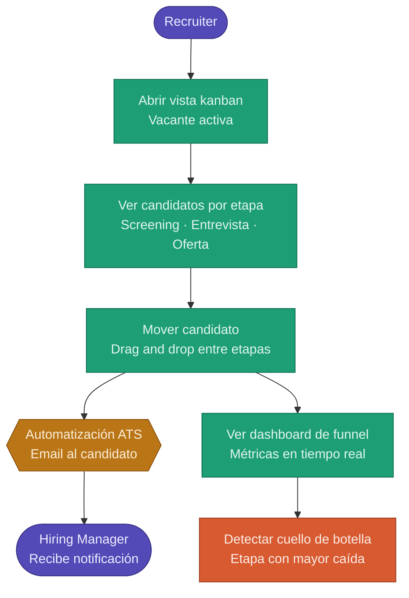
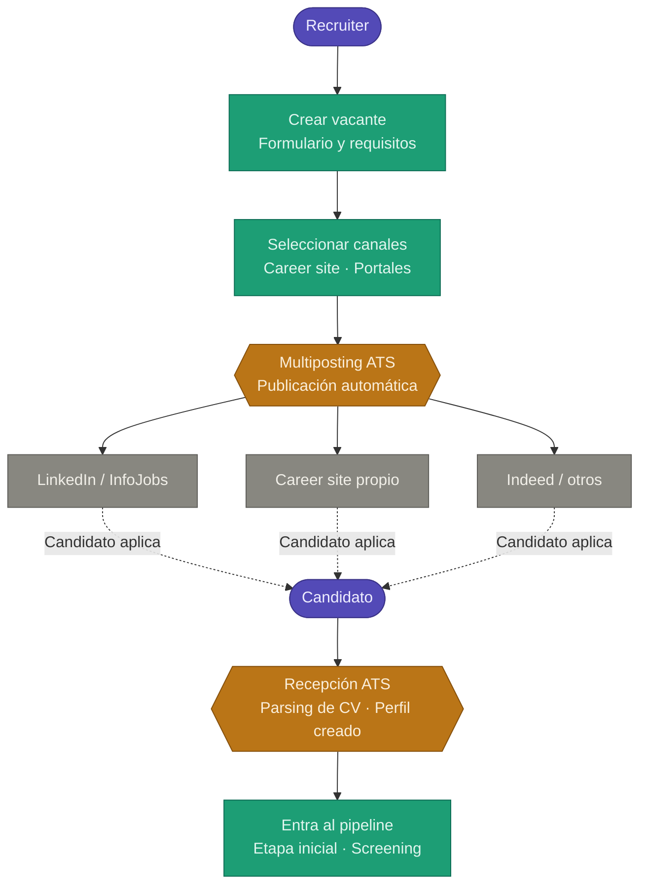
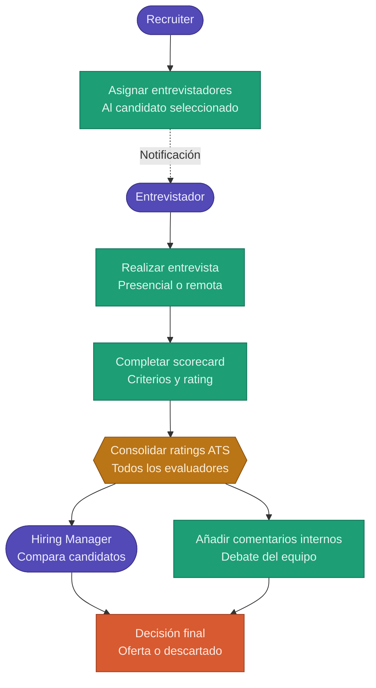
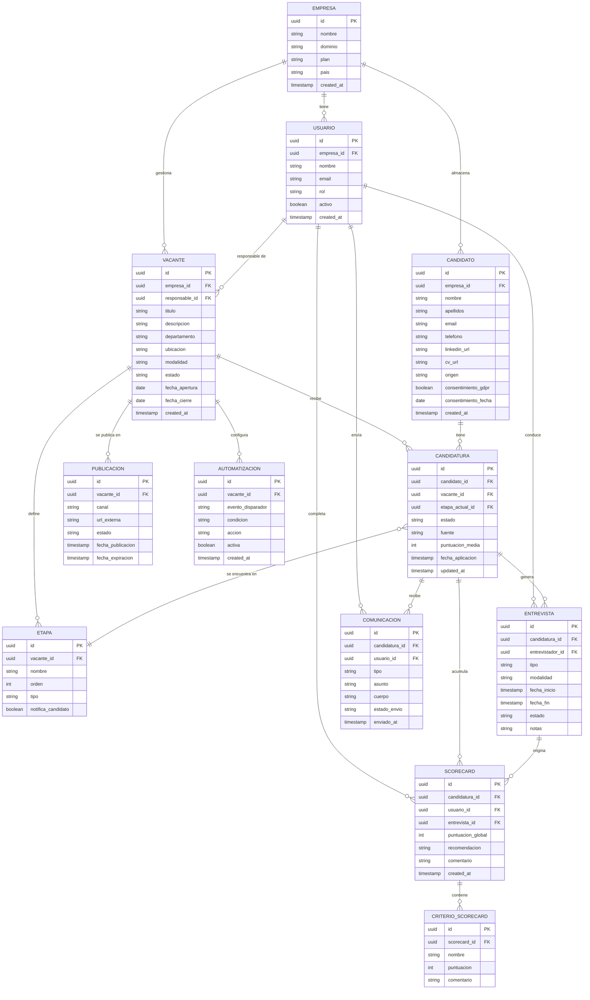
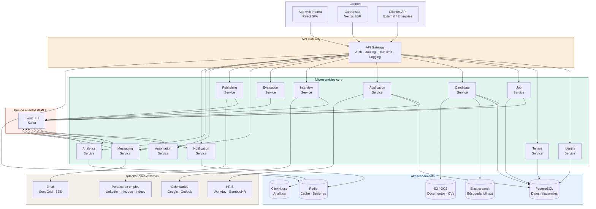

# PRD — Sistema ATS para la Gestión de Candidatos

> **Versión:** 1.3  
> **Fecha:** Abril 2026  
> **Estado:** Draft  
> **Autor:** Product Management

---

## Descripción del Producto

### ¿Qué es LTI ATS?

LTI ATS es un sistema de seguimiento de candidatos (Applicant Tracking System) diseñado para empresas con procesos de selección estructurados. Centraliza, automatiza y da visibilidad a todo el ciclo de reclutamiento: desde la apertura de una vacante hasta la contratación y el análisis posterior del proceso.

El sistema elimina la fragmentación típica de los procesos de recruiting apoyados en email, hojas de cálculo o portales de empleo aislados, y los reemplaza con un flujo de trabajo unificado, colaborativo y medible.

### Valor añadido

| Problema actual | Valor que aporta LTI ATS |
|---|---|
| Información dispersa en emails y carpetas | Base de datos centralizada y perfiles enriquecidos |
| Procesos manuales y repetitivos | Automatización de tareas de bajo valor |
| Falta de visibilidad del pipeline | Vista kanban en tiempo real para todo el equipo |
| Decisiones poco estructuradas | Scorecards, comparativas y feedback estructurado |
| Mala experiencia del candidato | Comunicación automatizada, rápida y consistente |
| Dificultad para escalar el hiring | Procesos estandarizados y replicables |

### Ventajas competitivas

1. **Configurabilidad del pipeline** — Etapas, campos y automatizaciones adaptables a cada proceso, sin necesidad de desarrollo.
2. **Colaboración nativa** — Hiring managers y entrevistadores participan dentro del sistema con permisos granulares, sin fricciones.
3. **Analítica accionable** — Métricas de funnel, source of hire y time-to-hire disponibles en tiempo real, sin exportar datos.
4. **Experiencia del candidato integrada** — Portal de empleo propio, comunicación automatizada y seguimiento de estado sin herramientas externas.
5. **Cumplimiento legal desde el diseño** — GDPR y retención de datos gestionados nativamente, sin añadidos.
6. **Curva de aprendizaje corta** — UX optimizada para recruiters con onboarding funcional en menos de una semana.

---

## Funciones Principales

### 1. Gestión de candidatos
Base de datos centralizada con perfiles completos (CV, experiencia, historial de interacciones), parsing automático de CV, búsqueda avanzada y filtrado por criterios estructurados.

### 2. Gestión de vacantes
Creación y edición de vacantes con pipelines personalizados, plantillas reutilizables y configuración de fases del proceso.

### 3. Publicación y distribución de ofertas
Multiposting en portales de empleo, career site propio con formularios personalizados y activación de canales de atracción.

### 4. Pipeline de selección
Vista kanban con drag & drop, estados configurables, automatización de cambios de fase y detección de cuellos de botella.

### 5. Comunicación con candidatos
Envío de emails desde el sistema, plantillas automatizadas, historial completo de comunicaciones y notificaciones a stakeholders.

### 6. Evaluación y colaboración interna
Scorecards estructurados, feedback entre entrevistadores y hiring managers, ratings y comparativas entre candidatos.

### 7. Coordinación de entrevistas
Integración con calendarios (Google, Outlook), scheduling automático, invitaciones y recordatorios.

### 8. Reporting y analítica
Dashboard con métricas clave (time-to-hire, cost-per-hire, source of hire, conversiones del funnel), exportación de informes y vista ejecutiva.

### 9. Automatización de procesos
Reglas automáticas basadas en eventos, workflows configurables e integraciones con herramientas externas vía API y webhooks.

### 10. Talent Pool
Base de candidatos reutilizable con etiquetado, segmentación y búsqueda interna para reapertura de procesos.

### 11. Cumplimiento legal
Gestión de consentimiento GDPR, control de retención de datos, anonimización de perfiles y auditoría de accesos.

---

## Lean Canvas
```
┌─────────────────────────────────────────────────────────────────────────────────────────┐
│                                     LEAN CANVAS — LTI ATS                               │
├──────────────────────┬───────────────────────────┬──────────────────────────────────────┤
│  PROBLEMA            │  SOLUCIÓN                 │  PROPUESTA DE VALOR ÚNICA            │
│                      │                           │                                      │
│ 1. Fragmentación de  │ · ATS centralizado con    │ El sistema de recruiting que         │
│    información en    │   pipeline visual          │ conecta a recruiters, hiring         │
│    emails y hojas    │ · Automatización de        │ managers y candidatos en un          │
│    de cálculo        │   tareas repetitivas       │ único flujo, sin fricción,           │
│                      │ · Comunicación integrada   │ medible desde el día uno.            │
│ 2. Procesos manuales │   con candidatos           │                                      │
│    que no escalan    │ · Analítica accionable     │                                      │
│                      │   en tiempo real           │                                      │
│ 3. Falta de          │                           │                                      │
│    visibilidad y     ├───────────────────────────┤                                      │
│    trazabilidad      │  VENTAJA INJUSTA          │                                      │
│                      │                           │                                      │
│ 4. Mala experiencia  │ · Pipeline 100%           │                                      │
│    del candidato     │   configurable            │                                      │
│                      │ · UX < 1 semana           │                                      │
│ 5. Decisiones poco   │   de onboarding           │                                      │
│    estructuradas     │ · GDPR nativo             │                                      │
├──────────────────────┼───────────────────────────┼──────────────────────────────────────┤
│  SEGMENTO DE         │  MÉTRICAS CLAVE           │  CANALES                             │
│  CLIENTES            │                           │                                      │
│                      │ · Time-to-hire            │ · Venta directa B2B                  │
│ Primario:            │ · Cost-per-hire           │ · Partnerships con consultoras       │
│ Empresas con 50–     │ · Tasa de adopción        │   de RRHH                            │
│ 5.000 empleados      │   interna (> 85%)         │ · Marketplaces de software           │
│ con procesos de      │ · NPS del candidato       │   (G2, Capterra)                     │
│ selección            │ · Hires por recruiter     │ · Inbound (SEO, contenido)           │
│ estructurados        │ · Tasa de conversión      │ · Prueba gratuita / freemium         │
│                      │   del pipeline            │                                      │
│ Usuarios operativos: │                           │                                      │
│ Recruiters, Talent   │                           │                                      │
│ Coordinators         │                           │                                      │
│                      │                           │                                      │
│ Decisores:           │                           │                                      │
│ Head of Talent,      │                           │                                      │
│ HR Director, COO     │                           │                                      │
├──────────────────────┴───────────────────────────┴──────────────────────────────────────┤
│  ESTRUCTURA DE COSTES                    │  FUENTES DE INGRESOS                         │
│                                          │                                              │
│ · Desarrollo y mantenimiento del producto│ · Suscripción SaaS mensual/anual             │
│ · Infraestructura cloud (multi-tenant)   │   (por nº de usuarios o vacantes activas)    │
│ · Equipo de Customer Success             │ · Tier de funcionalidades (Standard,         │
│ · Ventas y marketing B2B                 │   Professional, Enterprise)                  │
│ · Integraciones con terceros             │ · Servicios de onboarding e implementación   │
│ · Soporte y SLA                          │ · API access para integraciones enterprise   │
└──────────────────────────────────────────┴──────────────────────────────────────────────┘
```

---

## 1. Problema a resolver

Las empresas con procesos de selección estructurados enfrentan:

- Fragmentación de la información (emails, hojas de cálculo, job boards).
- Procesos manuales y repetitivos.
- Falta de visibilidad sobre el pipeline de selección.
- Decisiones poco estructuradas.
- Mala experiencia del candidato.
- Dificultad para escalar el hiring.

**Problema central:**  
El proceso de selección es ineficiente, poco escalable y carece de trazabilidad, impactando en coste, tiempo y calidad de contratación.

---

## 2. Objetivos del producto (medibles)

### Objetivos de negocio
- Reducir el **time-to-hire** en ≥ 30%.
- Reducir el **cost-per-hire** en ≥ 20%.
- Alcanzar **adopción interna > 85%**.
- Incrementar la **tasa de conversión del pipeline** en ≥ 15%.

### Objetivos de usuario
- Reducir tiempo administrativo del recruiter en ≥ 40%.
- Reducir tiempo medio de screening en ≥ 50%.
- Lograr ≥ 90% de procesos con feedback estructurado.

### Objetivos de experiencia
- Incrementar **NPS de candidatos** en +20 puntos.
- Reducir tiempo de respuesta al candidato a < 48h.

---

## 3. Usuarios y stakeholders

### Usuarios operativos
- Recruiters
- Talent Acquisition Specialists
- Talent Coordinators

### Usuarios secundarios
- Hiring Managers
- Entrevistadores

### Decisores de compra
- Head of Talent / HR Director
- COO / CEO
- CFO

---

## 4. Casos de uso principales

### CU-01 · Gestión del pipeline de selección

**Actor principal:** Recruiter  
**Actores secundarios:** Hiring Manager, Entrevistador  
**Objetivo:** Gestionar el avance de candidatos a través de las etapas del proceso de selección de forma visual, estructurada y colaborativa.

**Flujo principal:**
1. El recruiter abre la vista kanban de una vacante activa.
2. Visualiza todos los candidatos distribuidos por etapa (screening, entrevista, oferta…).
3. Mueve candidatos entre etapas mediante drag & drop.
4. El sistema dispara automáticamente comunicaciones al candidato al cambiar de etapa.
5. Los hiring managers reciben notificación y pueden consultar el estado en tiempo real.
6. El recruiter detecta cuellos de botella a través del dashboard de funnel.

**Precondiciones:** La vacante está creada y tiene candidatos asociados.  
**Postcondición:** El pipeline refleja el estado real del proceso en todo momento.

**Requisitos funcionales asociados:**
- RF-04: Vista kanban con drag & drop.
- RF-04: Estados configurables por vacante.
- RF-09: Automatización de notificaciones al cambiar de etapa.
- RF-08: Dashboard con métricas de funnel.


---

### CU-02 · Publicación y recepción de candidaturas

**Actor principal:** Recruiter  
**Actores secundarios:** Candidato, Portales de empleo  
**Objetivo:** Publicar una oferta en múltiples canales y centralizar la recepción de candidaturas en un único sistema.

**Flujo principal:**
1. El recruiter crea una vacante y configura el formulario de aplicación.
2. Selecciona los canales de publicación (career site, LinkedIn, InfoJobs…).
3. El sistema publica la oferta en todos los canales seleccionados (multiposting).
4. Los candidatos aplican desde cualquier canal.
5. El ATS recibe automáticamente las candidaturas, parsea los CVs y crea perfiles.
6. Los candidatos quedan asignados a la vacante en la etapa inicial del pipeline.

**Precondiciones:** La vacante está definida con descripción y requisitos.  
**Postcondición:** Las candidaturas están centralizadas, estandarizadas y listas para el screening.

**Requisitos funcionales asociados:**
- RF-03: Multiposting en portales de empleo.
- RF-03: Career site propio con formularios personalizados.
- RF-04: Parsing automático de CV y creación de perfiles.
- RF-08: Tracking de fuente de candidatura (source of hire).


---

### CU-03 · Evaluación y colaboración interna

**Actor principal:** Entrevistador  
**Actores secundarios:** Recruiter, Hiring Manager  
**Objetivo:** Recoger evaluaciones estructuradas de candidatos y facilitar la toma de decisión colectiva.

**Flujo principal:**
1. El recruiter asigna entrevistadores a un candidato.
2. Tras la entrevista, el entrevistador completa un scorecard con criterios predefinidos.
3. El sistema consolida los ratings de todos los evaluadores.
4. El hiring manager accede a la comparativa de candidatos.
5. El equipo añade comentarios internos y toma la decisión final.
6. El recruiter cambia el estado del candidato a "oferta" o "descartado".

**Precondiciones:** El candidato ha superado las fases anteriores del pipeline.  
**Postcondición:** La decisión queda registrada con trazabilidad completa del proceso evaluador.

**Requisitos funcionales asociados:**
- RF-06: Scorecards con criterios configurables.
- RF-06: Comparativa visual entre candidatos.
- RF-06: Comentarios internos con control de permisos.
- RF-11: Roles diferenciados (Recruiter, Entrevistador, Hiring Manager).


---

## 5. Modelo de datos

### Descripción de entidades

| Entidad | Descripción |
|---|---|
| **Empresa** | Organización cliente que usa el ATS. Unidad raíz del modelo multi-tenant. |
| **Usuario** | Cualquier persona con acceso al sistema (recruiter, hiring manager, entrevistador, admin). |
| **Vacante** | Posición abierta que la empresa necesita cubrir. Contiene el pipeline asociado. |
| **Etapa** | Fase del proceso de selección dentro de una vacante (screening, entrevista, oferta…). |
| **Candidato** | Persona que ha aplicado o ha sido añadida a la base de datos de talento. |
| **Candidatura** | Relación entre un candidato y una vacante. Registra el estado y el avance en el pipeline. |
| **Entrevista** | Evento de evaluación asociado a una candidatura, con fecha, participantes y resultado. |
| **Scorecard** | Evaluación estructurada completada por un entrevistador sobre una candidatura. |
| **Comunicación** | Mensaje enviado al candidato desde el sistema (email, notificación). |
| **Publicación** | Registro de la difusión de una vacante en un canal externo (portal de empleo, career site). |
| **Automatización** | Regla configurada que dispara acciones al cumplirse una condición en el pipeline. |

---

### Diagrama entidad-relación


### Notas sobre el modelo

- **Multi-tenancy:** `empresa_id` como clave de partición en todas las entidades principales garantiza el aislamiento de datos entre clientes.
- **GDPR:** El consentimiento se registra en `CANDIDATO` con fecha y booleano; la eliminación lógica o anonimización opera sobre esta entidad sin romper integridad referencial.
- **Pipeline flexible:** `ETAPA` es configurable por vacante y su campo `orden` permite reordenar fases sin alterar candidaturas ya existentes.
- **Trazabilidad:** `COMUNICACION` registra todo contacto con el candidato; `SCORECARD` y `CRITERIO_SCORECARD` guardan el historial evaluador completo con granularidad de criterio.
- **Source of hire:** El campo `fuente` en `CANDIDATURA` y `canal` en `PUBLICACION` permiten construir el informe de source of hire cruzando ambas entidades.
- **Automatizaciones:** La entidad `AUTOMATIZACION` desacopla las reglas de negocio del pipeline, permitiendo configurarlas sin código y asociarlas a vacantes concretas o a plantillas globales.

---

## 6. Diseño del sistema a alto nivel

### Descripción de la arquitectura

LTI ATS se construye sobre una arquitectura de **microservicios desacoplados**, desplegada en cloud (AWS / GCP) bajo un modelo **multi-tenant SaaS**. El diseño prioriza tres principios: separación de responsabilidades por dominio funcional, escalabilidad horizontal independiente por servicio y trazabilidad completa de eventos a través de un bus de mensajería asíncrono.

---

### Capas del sistema

#### Capa de clientes (Frontend)
El sistema expone dos superficies de usuario diferenciadas:

- **Aplicación web interna (SPA):** Interfaz principal para recruiters, hiring managers y entrevistadores. Construida en React, se comunica con el backend exclusivamente a través de la API Gateway. Consume WebSockets para actualizaciones en tiempo real del pipeline kanban.
- **Career site / portal de candidatos:** Aplicación pública optimizada para SEO y rendimiento mobile-first. Permite consultar ofertas, aplicar y hacer seguimiento del estado de la candidatura. Renderizado en Next.js con SSR para indexación en buscadores.

---

#### Capa de API Gateway
Punto de entrada único para todas las peticiones entrantes. Responsable de:

- **Autenticación y autorización:** Validación de JWT, integración con SSO (SAML / OAuth 2.0) y control de acceso basado en roles (RBAC).
- **Enrutamiento:** Despacho de peticiones al microservicio correspondiente.
- **Rate limiting y throttling:** Protección contra abuso y control de cuotas por tenant.
- **Logging centralizado:** Registro de todas las peticiones para auditoría y trazabilidad.

---

#### Capa de microservicios (Core)
Cada dominio funcional se implementa como un servicio independiente con su propia base de datos (patrón database-per-service):

| Servicio | Responsabilidad |
|---|---|
| **Identity Service** | Gestión de usuarios, roles, autenticación y permisos. |
| **Tenant Service** | Gestión de empresas, planes de suscripción y configuración por tenant. |
| **Job Service** | Vacantes, etapas del pipeline y configuración de procesos. |
| **Candidate Service** | Perfiles de candidatos, talent pool y parsing de CVs. |
| **Application Service** | Candidaturas, movimiento en el pipeline y estado. |
| **Interview Service** | Programación de entrevistas e integración con calendarios. |
| **Evaluation Service** | Scorecards, criterios y consolidación de evaluaciones. |
| **Messaging Service** | Envío de emails, plantillas y registro de comunicaciones. |
| **Publishing Service** | Multiposting en portales externos y gestión del career site. |
| **Automation Service** | Motor de reglas, evaluación de condiciones y disparo de acciones. |
| **Analytics Service** | Cálculo de métricas, construcción de dashboards y exportación de informes. |
| **Notification Service** | Notificaciones internas en tiempo real vía WebSocket y push. |

---

#### Capa de mensajería asíncrona (Event Bus)
Los microservicios se comunican entre sí de forma asíncrona a través de un **bus de eventos** (Apache Kafka). Cada cambio de estado relevante en el sistema (candidatura avanza de etapa, entrevista programada, scorecard completado) genera un evento que los servicios suscritos consumen de forma independiente. Este diseño garantiza:

- **Desacoplamiento:** Los servicios no se llaman directamente entre sí.
- **Escalabilidad:** Cada consumidor procesa a su propio ritmo.
- **Trazabilidad de eventos:** El log de Kafka actúa como registro inmutable de toda la actividad del sistema.
- **Base de las automatizaciones:** El Automation Service escucha el bus y evalúa si los eventos recibidos deben disparar reglas configuradas por el cliente.

---

#### Capa de almacenamiento
Cada microservicio usa el tipo de base de datos más adecuado a su modelo de datos:

| Almacenamiento | Uso |
|---|---|
| **PostgreSQL** | Datos relacionales principales: candidatos, vacantes, candidaturas, usuarios. Particionado por `empresa_id` para multi-tenancy. |
| **Redis** | Caché de sesiones, rate limiting, datos de pipeline en tiempo real. |
| **Elasticsearch** | Búsqueda full-text sobre candidatos y talent pool. |
| **Amazon S3 / GCS** | Almacenamiento de CVs, documentos adjuntos y exports. |
| **ClickHouse** | Base de datos analítica columnar para el Analytics Service (time-to-hire, funnels, source of hire). |

---

#### Capa de integraciones externas
El sistema se conecta con terceros a través de adaptadores dedicados dentro del Publishing Service y el Interview Service:

- **Portales de empleo:** LinkedIn, InfoJobs, Indeed — integración vía API o XML feed.
- **Calendarios:** Google Calendar y Microsoft Outlook — integración vía OAuth 2.0.
- **HRIS:** Workday, BambooHR, Personio — integración vía webhooks bidireccionales.
- **Email:** SendGrid / Amazon SES para el envío transaccional.
- **API pública:** REST API documentada (OpenAPI 3.0) y webhooks salientes para integraciones custom de clientes enterprise.

---

#### Capa de infraestructura y operaciones
- **Orquestación:** Kubernetes (EKS / GKE) con auto-scaling horizontal por servicio.
- **CI/CD:** GitHub Actions con pipelines de build, test y despliegue por entorno (dev, staging, prod).
- **Observabilidad:** OpenTelemetry para trazas distribuidas, Prometheus + Grafana para métricas, y ELK Stack para logs centralizados.
- **Seguridad:** Secrets gestionados en AWS Secrets Manager / HashiCorp Vault. Comunicaciones internas cifradas con mTLS.

---

### Diagrama de arquitectura a alto nivel


---

### Decisiones de arquitectura clave

| Decisión | Elección | Justificación |
|---|---|---|
| Patrón arquitectónico | Microservicios | Permite escalar y desplegar cada dominio de forma independiente. Facilita el crecimiento del equipo de ingeniería por squads. |
| Comunicación entre servicios | Asíncrona via Kafka | Desacopla productores y consumidores. Habilita el motor de automatizaciones sin acoplar servicios entre sí. |
| Multi-tenancy | Shared database, partición por `empresa_id` | Equilibrio entre coste operativo y aislamiento. La migración a bases de datos dedicadas por tenant queda disponible para planes Enterprise. |
| Base de datos analítica | ClickHouse (columnar) | Las consultas de reporting (time-to-hire, funnels) son agregaciones sobre grandes volúmenes. Las bases columnares las resuelven en millisegundos frente a PostgreSQL. |
| Búsqueda de candidatos | Elasticsearch | Soporta búsqueda full-text, filtros combinados y fuzzy matching sobre el talent pool sin impacto en la base de datos transaccional. |
| Frontend del career site | Next.js con SSR | Las ofertas de empleo deben ser indexables por buscadores. El SSR garantiza que el contenido esté disponible para los crawlers sin depender de JavaScript en cliente. |
| API pública | REST + OpenAPI 3.0 | Estándar ampliamente adoptado en el ecosistema HR Tech. Facilita la integración con HRIS y herramientas enterprise. |

---

## 7. User Stories principales

### Gestión de candidatos
- Como recruiter, quiero centralizar candidatos para evitar pérdida de información.
- Como recruiter, quiero filtrar candidatos rápidamente por criterios estructurados.

### Gestión de vacantes
- Como recruiter, quiero crear vacantes con pipelines personalizados.
- Como hiring manager, quiero visibilidad del estado de cada vacante.

### Pipeline de selección
- Como recruiter, quiero mover candidatos entre etapas fácilmente.
- Como equipo, quiero detectar cuellos de botella en el proceso.

### Comunicación
- Como recruiter, quiero enviar emails con plantillas sin salir del sistema.
- Como candidato, quiero recibir comunicación clara sobre el estado de mi candidatura.

### Evaluación
- Como entrevistador, quiero dejar feedback estructurado tras cada entrevista.
- Como hiring manager, quiero comparar candidatos objetivamente.

### Reporting
- Como Head of Talent, quiero ver métricas clave del proceso de selección.
- Como empresa, quiero identificar las mejores fuentes de candidatos.

### Automatización
- Como recruiter, quiero automatizar tareas repetitivas para dedicar tiempo a lo que importa.

---

## 8. Requisitos funcionales

### 8.1 Gestión de candidatos
- Base de datos centralizada con historial completo.
- Parsing automático de CV.
- Perfiles enriquecidos (experiencia, habilidades, notas, documentos).
- Búsqueda y filtrado avanzado.

### 8.2 Gestión de vacantes
- Creación, edición y clonación de vacantes.
- Pipelines personalizados por vacante o plantilla.
- Estados y configuración de fases.

### 8.3 Publicación de ofertas
- Multiposting en portales de empleo (InfoJobs, LinkedIn, Indeed…).
- Career site propio con formularios personalizados.
- Tracking de fuente de candidatura.

### 8.4 Pipeline de selección
- Vista kanban con drag & drop.
- Estados configurables.
- Automatización de cambios de estado.
- Alertas de inactividad.

### 8.5 Comunicación
- Envío de emails desde el sistema.
- Plantillas personalizables.
- Historial de comunicaciones por candidato.
- Notificaciones internas.

### 8.6 Evaluación
- Scorecards con criterios configurables.
- Feedback estructurado por fase.
- Ratings y comentarios internos.
- Comparativa visual entre candidatos.

### 8.7 Coordinación de entrevistas
- Integración con Google Calendar y Outlook.
- Scheduling con disponibilidad del entrevistador.
- Recordatorios automáticos.

### 8.8 Reporting
- Dashboard con métricas: time-to-hire, funnel, source of hire, cost-per-hire.
- Exportación de informes (CSV, PDF).
- Filtros por vacante, equipo, periodo.

### 8.9 Automatización
- Reglas basadas en eventos (candidato avanza → enviar email).
- Workflows configurables sin código.
- Screening automático por criterios.

### 8.10 Talent Pool
- Base reutilizable de candidatos no seleccionados.
- Etiquetado y segmentación.
- Búsqueda y contacto interno.

### 8.11 Gestión de permisos
- Roles: Admin, Recruiter, Hiring Manager, Entrevistador.
- Control de acceso por vacante o equipo.

### 8.12 Integraciones
- Job boards y portales de empleo.
- Calendarios (Google, Outlook).
- HRIS (Workday, BambooHR…).
- API REST y webhooks para integraciones custom.

### 8.13 Cumplimiento legal
- Gestión de consentimiento GDPR.
- Control de retención y eliminación de datos.
- Auditoría de accesos.
- Anonimización de perfiles.

---

## 9. Requisitos no funcionales

### Rendimiento
- Carga de vistas principales < 2 segundos.
- Soporte para bases de datos > 100.000 candidatos.

### Disponibilidad
- SLA ≥ 99,5%.

### Seguridad
- Encriptación en tránsito (TLS) y en reposo (AES-256).
- SSO y MFA.
- Cumplimiento GDPR.

### Escalabilidad
- Arquitectura multi-tenant.
- Soporte multi-país e idioma.

### Usabilidad
- Curva de aprendizaje < 1 semana para usuarios operativos.
- UX optimizada para flujos de trabajo recurrentes.

### Fiabilidad
- Integridad de datos garantizada.
- Logs auditables.
- Backup automático.

---

## 10. Criterios de éxito

| Dimensión | Métrica | Objetivo |
|---|---|---|
| Adopción | % usuarios activos / vacantes en sistema | > 85% |
| Eficiencia | Reducción de tiempo administrativo | ≥ 40% |
| Eficiencia | Reducción de time-to-hire | ≥ 30% |
| Calidad | Tasa de aceptación de ofertas | Mejora ≥ 10% |
| Calidad | Retención a 6 meses de contratados | Mejora ≥ 10% |
| Experiencia | NPS del candidato | +20 puntos |
| Experiencia | Tiempo de respuesta al candidato | < 48h |
| ROI | Cost-per-hire | Reducción ≥ 20% |
| ROI | Hires por recruiter al año | Incremento ≥ 15% |

---

## 11. Alcance MVP

### Incluido en MVP
- Gestión de candidatos (base de datos + parsing de CV).
- Pipeline básico con vista kanban.
- Publicación de ofertas y career site.
- Comunicación por email con plantillas.
- Reporting básico (time-to-hire, funnel, source).
- Gestión de permisos por roles.

### Excluido del MVP (fases posteriores)
- Automatización avanzada y workflows complejos.
- Integraciones con HRIS.
- Analítica avanzada y dashboards personalizados.
- Talent pool con IA de recomendación.
- API pública para integraciones custom.

---

## 12. Riesgos

| Riesgo | Probabilidad | Impacto | Mitigación |
|---|---|---|---|
| Resistencia al cambio del equipo | Alta | Alto | Onboarding guiado y Quick Wins tempranos |
| Baja calidad de datos iniciales | Media | Medio | Herramientas de importación y limpieza de datos |
| Dependencia de integraciones externas | Media | Alto | MVP sin integraciones críticas; API en fase 2 |
| Complejidad UX percibida | Media | Alto | UX testing con recruiters reales antes de lanzar |
| Adopción baja de hiring managers | Alta | Medio | Vista simplificada y notificaciones push para HM |

---

## 13. Supuestos

- La empresa tiene un volumen de contratación suficiente para justificar un ATS (> 10 vacantes/año o procesos simultáneos recurrentes).
- Existe al menos un recruiter o responsable de RRHH dedicado.
- La empresa tiene disposición para estandarizar y documentar sus procesos de selección.
- Los decisores de compra entienden el ROI de reducir el time-to-hire y el cost-per-hire.

---

*Documento vivo — sujeto a revisión tras validación con usuarios y stakeholders.*